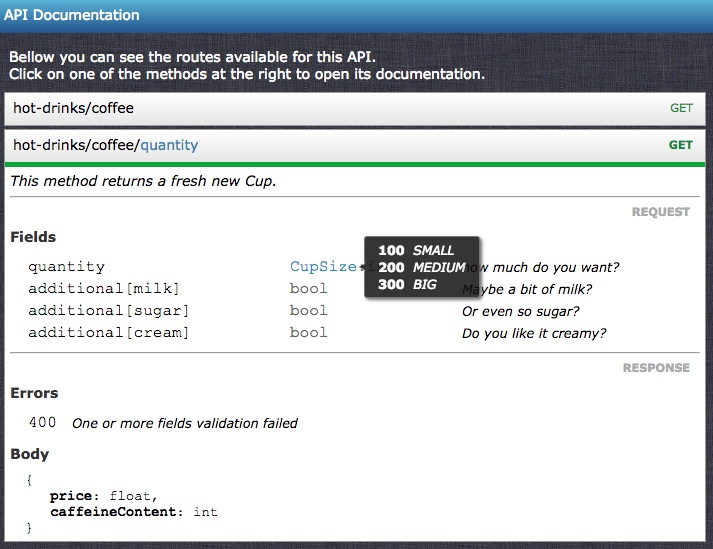

# CleaRest

This is a annotation based framework that helps writing RESTful APIs with less boilerplate code,
easier testing and more separation of responsibilities in services.
It provides its own dependency injection mechanism as well data handling, easy validation
*auto generated documentation*.

* [Install](#install)
* [Quick Start](#quick-start)
* Features
  * [Enums](#enums)
  * [Auto generated documentation](#auto-generated-documentation)
  * [Dependency Injection](#dependency-injection)
  * [Exception handling](#exception-handling)
* More information
  * [Annotations](docs/annotations.md)
  * [Validations](docs/validations.md)
  * [Capabilities](docs/capabilities.md)
  * [Router](docs/router.md)
  * [Request Handlers](docs/handlers.md)
  * [Metadata generation](docs/metadata.md)
  * [Other features](docs/other-features.md)
    * [File upload](docs/other-features.md#file-upload)
    * [Header annotation](docs/other-features.md#header-annotation)
    * [Content-Type encoders](docs/other-features.md#content-type-encoders)
    * [Session service](docs/other-features.md#session-service)
    * [Environments](docs/other-features.md#environments)


---

## Install

Install via [Composer](http://getcomposer.org)
```json
{
    "repositories": [
        {
            "type":"package",
            "package": {
              "name": "junior-ferraz/clearest",
              "version":"master",
              "source": {
                  "url": "https://github.com/junior-ferraz/php-clearest.git",
                  "type": "git",
                  "reference":"master"
                }
            }
        }
    ],
    "require": {
        "zeptech/annotations": "1.1.0",
        "symfony/yaml": "^3.2",
        "junior-ferraz/clearest": "master"
    },
    "autoload": {
        "psr-4": {
            "CleaRest\\": "vendor/junior-ferraz/clearest/src/"
        }
    }
}
```

## Quick Start

### 1. Create a service

In ClearRest every component or smallest portion of logic is concentrated in its own service.
A service is an interface that extends `Clearest\Services\Service` and has its own methods.
Each service can have many implementations (versions), as we see following.

To start, lets create a service in the file *src/MyBakery/HotDrinks/CoffeeService.php*.
```php
<?php
namespace MyBakery\HotDrinks;

use CleaRest\Services\Service;

interface CoffeeService extends Service
{
    /**
     * This method returns a fresh new Cup.
     *
     * @param int $quantity cup size in ml
     * @return CoffeeCup
     */
    public function getCup($quantity = 200);
}
```
This service returns the object bellow, written in *src/MyBakery/HotDrinks/CoffeCup.php*.
Objects received or returned by a service exposed via an API must be signed as plain object, 
by implementing the interface `Cleares\Api\Data\PlainObject`;
```php
<?php
namespace MyBakery\HotDrinks;

use CleaRest\Api\Data\PlainObject;

class CoffeeCup implements PlainObject
{
    /**
     * Price in EUR
     * @var float
     */
    public $price;

    /**
     * Amount of Caffeine in mg
     * @var int
     */
    public $caffeineContent;
}
```
### 2. Create an implementation

Each service can have multiple implementations, or versions. 
By default the framework picks up the highest implementation for a service, unless there is a conditional injection.
We will treat this conditioning later on. But by now consider these both implementations of CoffeeService.

The first in the file *src/MyBakery/HotDrinks/Versions/DripCoffee.php*.
```php
<?php
namespace MyBakery\HotDrinks\Versions;

use CleaRest\Services\BaseService;
use MyBakery\HotDrinks\CoffeeCup;
use MyBakery\HotDrinks\CoffeeService;

/**
 * Suppose in the beginning the backery had ony a drip coffee machine.
 * A cup of drip coffee costs 0.50 EUR per 100ml and contains 40mg of caffeine in that quantity
 *
 * @version 1 Drip
 */
class DripCoffee extends BaseService implements CoffeeService
{
    public function getCup($quantity = 200) {
        $cup = new CoffeeCup();
        $cup->price = 0.50 * ($quantity / 100);
        $cup->caffeineContent = 40 * ($quantity / 100);

        return $cup;
    }
}
```

The second in the file *src/MyBakery/HotDrinks/Versions/EspressoCoffee.php*.
```php
<?php
namespace MyBakery\HotDrinks\Versions;

use CleaRest\Services\BaseService;
use MyBakery\HotDrinks\CoffeeCup;
use MyBakery\HotDrinks\CoffeeService;

/**
 * Later on, the backery bough a espresso machine.
 * Although the drip coffee machine can still be used, the espresso machine is now used as default.
 * A cup of espresso costs 1.50 EUR per 100ml and contains 120mg of caffeine in that quantity
 *
 * @version 2 Espresso
 */
class EspressoCoffee extends BaseService implements CoffeeService
{
    public function getCup($quantity = 200) {
        $cup = new CoffeeCup();
        $cup->price = 1.50 * ($quantity / 100);
        $cup->caffeineContent = 120 * ($quantity / 100);

        return $cup;
    }
}
```

Note that every service implementation must have a `@version` annotation on top of it.
The first (and mandatory) argument for this annotation is the version number, the second (but optional) is the name.

Those examples extend from `CleaRest\Services\BaseService` because the *Service* interface has methods
already implemented in the *BaseService*. 
If you don't want to implement those by your own it's convenient to extend from *BaseService*.

### 3. Set up the API

First of all you must set a Rewrite rule to redirect your requests to a *index.php*.
Here you can see an example of how to do it in a *.htaccess* file for Apache server.
```htaccess
<IfModule mod_rewrite.c>
    RewriteEngine on
    RewriteRule    (.*) index.php    [L]
</IfModule>
```
In the *index.php* file, you must load the framework and start a router
```php
<?php
include '../../vendor/autoload.php';

\CleaRest\Framework::start();

$request = new \CleaRest\Api\Network\HttpRequest();
$response = new \CleaRest\Api\Network\HttpResponse();
$router = new \CleaRest\Api\Router();

$router->process($request, $response);
$response->render();
```
It's suggested to put all the publicly accessible files in a *public* folder in the root level of your project.
For example this api index file would stay in *public/api/index.php* and the *.htaccess* file in *public/api/.htaccess*.
Then configure your webservice to look for this folder when the api domain (e.g api.localhost) is called.


### 4. Bind the service to the router

Any service can be used as resource in a router. To bind a service to a route you simply have to add it to
the route associating it with a HTTP verb. 
See the modified *index.php* as example:
```php
<?php
use CleaRest\Api\Network\HttpRequest;
use CleaRest\Api\Network\HttpResponse;
use CleaRest\Api\Router;

include '../../vendor/autoload.php';

\CleaRest\Framework::start();

$request = new \CleaRest\Api\Network\HttpRequest();
$response = new \CleaRest\Api\Network\HttpResponse();
$router = new \CleaRest\Api\Router();

// In this route the parameter $quantity can be added to the request as a field or query string param
$router->getRoute('hot-drinks/coffee')
    ->addMethod('GET', \MyBakery\HotDrinks\CoffeeService::class, 'getCup');

// In this route the parameter $quantity comes from the url itself
$router->getRoute('hot-drinks/coffee/$quantity')
    ->addMethod('GET', \MyBakery\HotDrinks\CoffeeService::class, 'getCup');

$router->process($request, $response);
$response->render();
```

It's also possible to write this configuration in a Yaml file for better readability.
If you want todo so, create a file (e.g. *public/api/router.yml*) with thes configuration:
```yml
Routes:
  hot-drinks/coffee:
    GET: MyBakery\HotDrinks\CoffeeService:getCup
  hot-drinks/coffee/$quantity:
    GET: MyBakery\HotDrinks\CoffeeService:getCup
```
For more information about how to use Yaml files to configure your router, [click here](docs/router.md).

### 5. Run it

The framework works on the classes and interfaces metadata (annotations, extensions, implementations etc).
We know it's not a good idea to collect this metadata in runtime, 
so the framework has a tool to generate all the metadata and save it into files.

To run the metadata generator, use the command line (at the root of your project). 
```sh
php vendor/junior-ferraz/clearest/scripts/genmetada.php src/ MyBakery
```
The first argument after the script is the source folder where the files will be checked to generate the metadata from.
The second argument is the upmost root of the namespace in which classes will be considered.
The metadata files will be save, by default, in the folder *metadata* on the root level of the project.

**Done!** now you can use your favorite REST client to call, for example, the endpoints:
- GET /hot-drinks/coffee?size=250
- GET /hot-drinks/coffee/400

All the serialization and data handling is done automatically. Check bellow for further information of how to use complex
object, conditional calling, dependency injection, exception handling, validation etc.

Once the metadata changed (new interface implemented, or object created, annotation modified) it's necessary to run
the metadata generator again.
For more information about the metadata generation options, [click here](docs/metadata.md).


## Features

There are several features created to simplify data handling and validation as well documentation.
See bellow some of these features.

### Enums

Often we have arguments that accept only a set of values defined.
Modern languages have *Enums* for those cases, but PHP does not offer such structure.
To work around this limitation, CleaRest has the annotation `@enum` that can be set to a method parameter or an object property.

Consider the *CoffeeService* example shown above. The parameter *$quantity* could be limited to only three sizes of cup:
small (100), medium (200) or big (300). Those values could be set in a class or interface that does the enum role:

Write in a file *src/MyBakery/HotDrinks/Versions/CupSize.php*.
```php
<?php
namespace MyBakery\HotDrinks;

interface CupSize
{
    const SMALL = 100;
    const MEDIUM = 200;
    const BIG = 300;
}
```

By adding an `@enum` annotation to the interface method, the framework takes care of the validation by itself.
```php
namespace MyBakery\HotDrinks;

use CleaRest\Services\Service;

interface CoffeeService extends Service
{
    /**
     * This method returns a fresh new Cup.
     *
     * @enum CupSize $quantity
     * @param int $quantity cup size in ml
     * @return CoffeeCup
     */
    public function getCup($quantity = 200);
}
```
If a request with `$quantity = 150` will return the response `400` (Bad Request) with this body 
(always remember to run the metadata generation if you change any annotation or structure):
```json
{
  "error": {
    "message": "Validation failed"
  },
  "violations": [
    {
      "message": "Value does not belong to enum",
      "field": "quantity",
      "value": 150
    }
  ]
}
```

### Using objects as parameters

Objects can also be used as parameters for your service. They must implement the interface
`Cleares\Api\Data\PlainObject` and contain only scalar or plain object properties.
See the an extension to the *CoffeeService* bellow:

```php
<?php
namespace MyBakery\HotDrinks;

use CleaRest\Services\Service;

interface CoffeeService extends Service
{
    /**
     * This method returns a fresh new Cup.
     *
     * @enum CupSize $size
     * @param int $size cup size in ml
     * @param CoffeeAdditional $additional what else do you want in your coffee?
     * @return CoffeeCup
     */
    public function getCup($size = 200, CoffeeAdditional $additional = null);
}
```
And here the additional object *src/MyBakery/HotDrinks/CoffeeAdditional.php*.
Any parameter marked with a default value (in this case null) means it is optional.
```php
<?php
namespace MyBakery\HotDrinks;

use CleaRest\Api\Data\PlainObject;

class CoffeeAdditional implements PlainObject
{
    /**
     * Maybe a bit of milk?
     * @var bool
     */
    public $milk;

    /**
     * Or even so sugar?
     * @var bool
     */
    public $sugar;

    /**
     * Do you like it creamy?
     * @var bool
     */
    public $cream;
}
```

The request fields for this call would look like this:
```
GET /hot-drinks/coffee
quantity=200
additional[milk]=true
additional[sugar]=true
```

Read more detailed information about using objects [here](docs/objects.md)

### Auto generated documentation

One of the most convenient features of CleaRest is the auto generated documentation.
This is done automatically based on the router resources and the services metadata.

To expose the api documentation for the examples above, create a file (e.g. at *public/docs/index.php*).
```php
<?php
include '../../vendor/autoload.php';

\CleaRest\Framework::start();

$router = \CleaRest\Api\RouterBuilder::createFromFile('../api/router.yml');

$generator = new \CleaRest\Api\Documentation\Generator($router);
$generator->render();
```

Then configure your webservice to a docs address (e.g. docs.localhost) pointing to that folder.
This is how it looks like when you access the address on your browser


For more information about how to customize the auto generated documentation [click here](docs/auto-docs.md).

### Dependency injection

The dependency injection in CleaRest is very simple to use. 
You just have to create a protected property in your service class with a `@var` with a service interface and a
`@inject` annotation on top of it. For example:
```php
<?php
namespace MyBakery\HotDrinks\Versions;

use CleaRest\Services\BaseService;
use MyBakery\HotDrinks\CappuccinoService;
use MyBakery\HotDrinks\CoffeeAdditional;
use MyBakery\HotDrinks\CoffeeService;

/**
 * @version 1
 */
class CappuccinoImpl extends BaseService implements CappuccinoService
{
    /**
     * @inject
     * @var CoffeeService
     */
    protected $coffee;
    
    public function getCup($quantity)
    {
        $add = new CoffeeAdditional();
        $add->milk = true;
        $cup = $this->coffee->getCup($quantity, $add);
        $cup->price += 1.00;
        return $cup;
    }
}
```
By default the highest version of *CoffeeService* will be taken (in this case *EspressoService*),
but it's possible to configure conditional injection. [Click here](docs/di.md) to check how it works.

### Exception Handling

For security reasons, by default, exceptions are returned as 500 (Internal Server Error) to the client.
But if you want the exception to be returned to the client with meaningful information, 
you can implement your own exception extending from `CleaRest\Api\Exceptions\ApiException`.
This will make the exception visible in the API, with specific status codes and response bodies.

To know how to handle exceptions [click here](docs/exceptions.md)