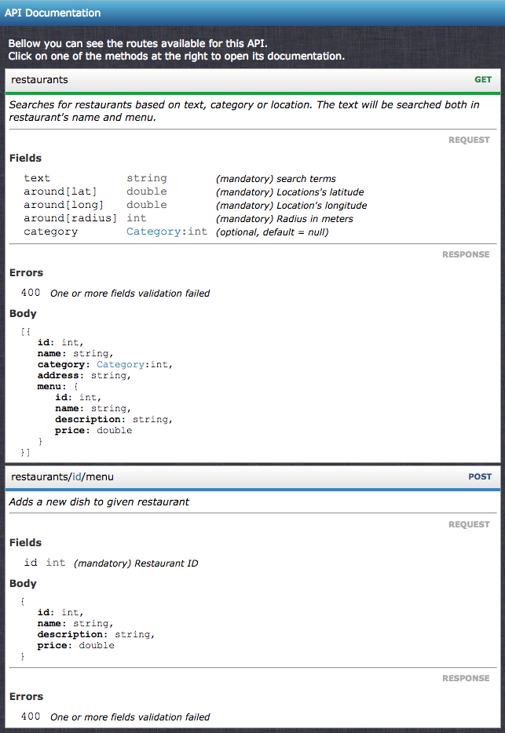
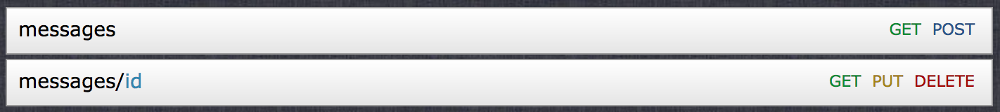
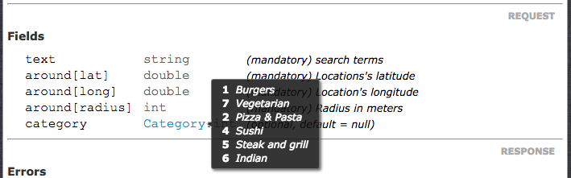
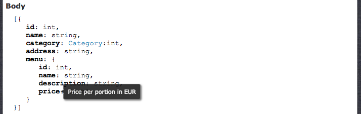

# Auto generated documentation

We all developers agree in at least one point: documenting sucks!

To help solving this boring but necessary task, CleaRest provides an auto generated documentation out of
services and objects metadata.

The example bellow shows the documentation and the code where the metadata was extracted from.
The following sections explain what information is collected from the metadata to be shown in the documentation.



File *src/FoodPortal/Restaurants/SearchService.php*:
```php
<?php
namespace FoodPortal\Restaurants;

use CleaRest\Services\Service;
use FoodPortal\Locations\GeoLocation;

interface SearchService extends Service
{
    /**
     * Searches for restaurants based on text, category or location.
     * The text will be searched both in restaurant's name and menu.
     *
     * @enum Category $category
     * @param string $text search terms
     * @param int $category
     * @param GeoLocation $around
     * @return Restaurant[]
     */
    public function search($text, GeoLocation $around, $category = null);
}
```
File *src/FoodPortal/Restaurants/Category.php*:
```php
<?php

namespace FoodPortal\Restaurants;

interface Category
{
    /**
     * Burgers
     */
    const BURGER = 1;
    /**
     * Vegetarian
     */
    const VEGETARIAN = 7;
    /**
     * Pizza & Pasta
     */
    const PIZZA_PASTA = 2;
    /**
     * Sushi
     */
    const SUSHI = 4;
    /**
     * Steak and grill
     */
    const STEAK = 5;
    /**
     * Indian
     */
    const INDIAN = 6;
}
```
File *src/FoodPortal/Locations/GeoLocation.php*:
```php
<?php
namespace FoodPortal\Locations;

use CleaRest\Api\Data\PlainObject;

class GeoLocation implements PlainObject
{
    /**
     * Locations's latitude
     * @var double
     */
    public $lat;
    /**
     * Location's longitude
     * @var double
     */
    public $long;
    /**
     * Radius in meters
     * @var int
     */
    public $radius;
}
```
File *src/FoodPortal/Restaurants/Restaurant.php*:
```php
<?php
namespace FoodPortal\Restaurants;

use CleaRest\Api\Data\PlainObject;

class Restaurant implements PlainObject
{
    /**
     * @var int
     */
    public $id;
    /**
     * Restaurant's name
     * @var string
     */
    public $name;
    /**
     * Food category
     * @enum Category
     * @var int
     */
    public $category;
    /**
     * Full restaurant's adress
     * @var string
     */
    public $address;
    /**
     * List of available dishes
     * @var Dish
     */
    public $menu;
}
```
File *src/FoodPortal/Restaurants/Dish.php*:
```php
<?php
namespace FoodPortal\Restaurants;

use CleaRest\Api\Data\PlainObject;

class Dish implements PlainObject
{
    /**
     * @var int
     */
    public $id;
    /**
     * Dish name
     * @var string
     */
    public $name;
    /**
     * Dish description
     * @var string
     */
    public $description;
    /**
     * Price per portion in EUR
     * @var double
     */
    public $price;
}
```
File *src/FoodPortal/Restaurants/MenuService.php*:
```php
<?php
namespace FoodPortal\Restaurants;

use CleaRest\Services\Service;

interface MenuService extends Service
{
    /**
     * Adds a new dish to given restaurant
     *
     * @body $dish
     * @param int $id Restaurant ID
     * @param Dish $dish
     */
    public function addDish($id, Dish $dish);
}
```
File *public/api/router.yml*:
```yaml
Routes:
  restaurants:
    GET: FoodPortal\Restaurants\SearchService:search
  restaurants/$id/menu:
    POST: FoodPortal\Restaurants\MenuService:addDish
```

## Routes and Verbs

Every route registered in the router will be rendered as a panel, and its methods will be available at the right.
URI parameters are highlighted in the route name.

A router with this configuration...
```yaml
Routes:
  messages:
    GET: MyCompany\Messages\MessageList::get
    POST: MyCompany\Messages\MessageEditor::create
  messages/$id:
    GET: MyCompany\Messages\MessageList::getById
    PUT: MyCompany\Messages\MessageEditor::update
    DELETE: MyCompany\Messages\MessageEditor::remove
```
... would render those routes:



If the user clicks on the method it will open its documentations.

## Request

All the request documentation is generated based on the service method's signature, doc comment and annotations.

### Fields

The fields name are the same as the method's parameters names 
and their types and description come from the `@param` annotation.
Object parameters will be shown as the expected array structure for the fields.

Fields or properties annotated with `@enum` will show up with a highlighted type on the documentation.
If the user moves the mouse on the type, a pop up balloon is show with all the enum values.



The label for the respective value is taken from the doc comment above the constant. 
If no doc comment is written, the name of the constant is taken instead.

### Body

The request body is generated based on the parameter specified in the `@body` annotation.
The object's structure is rendered in *JSON*.



If the user put the mouse over the property, a balloon will be shown, containing the property description.

If you want to know how to configure the request body using the `@body` annotation, 
[click here](objects.md#as-request-body)

### Headers

The headers section is generated based on the `@header` annotations defined on the method's doc comment.
[Click here](other-features.md#header-annotation) to see how to use it.


## Response

All the response documentation is also generated based on few annotations in the service method's doc comment.

### Error Codes

The error codes section is generated based on the `@throw` annotations defined on the method's doc comment.
The first argument from the annotation is the exception class, the second is the exception code or constant
and the third on wards is the description telling when it happens.

### Body

The response body is generated based on the type defined on the `@return` annotation.
The object structure is rendered as *JSON* just as the request body is.
Both enums and property descriptions have balloons in this body as well.

## How to generate documentation

All the documentation takes a `Router` as argument to generate it.
That means, only one documentation is possible per router.

It's possible to generate the default documentation scheme or customize it.

### Setting up

Create a php file accessible for the documentation. The example bellow was put in current project's 
root */public/docs/index.php* and a webservice pointing from *docs.api.localhost* to this file.
```php
<?php
include '../../vendor/autoload.php';

\CleaRest\Framework::start();

// Load the router either from the it's initialization file or Yaml configuration
$router = \CleaRest\Api\RouterBuilder::createFromFile('../api/router.yml');

// Create a documentation generator out of a router
$generator = new \CleaRest\Api\Documentation\Generator($router);
// Render documentation
$generator->render();
```

### Customizing

Few customizations are possible. You can change the documentation title, add scripts or style sheets,
overriding or extending current layout classes and behavior.

Consider we use the `$generator` instance shown in the file above:
```php
// Changing Title
$generator->setTitle('MyCompany - API documentation');

// Adding JavaScript
$generator->addScript('/physical/path/script/file.js');

// Adding CSS file
$generator->addCssFile('/physical/path/sheet/file.css');
```