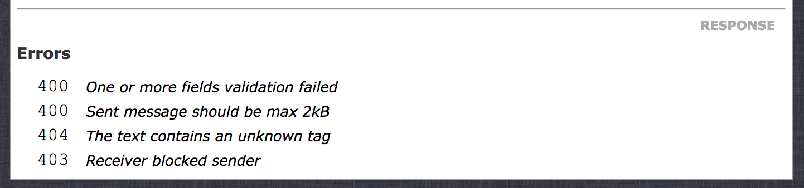

# Exception Handling

For security reasons, by default, all exceptions are returned as 500 (Internal Server Error) to the client.
But if you want the exception to be returned to the client with meaningful information there are some options:

## ApiException

Any exception extending `CleaRest\Api\Exceptions\ApiException` is visible to the client.
The extended class shall provide a mapping between the exception code and the HTTP status code that should be returned.
See the example bellow
```php
<?php
use \CleaRest\Api\Exceptions\ApiException;

class ChatException extends ApiException
{
    const MESSAGE_TOO_LONG = 1;
    const TAG_NOT_FOUND = 2;
    const USER_BLOCKED_YOU = 3;
    
    protected $codeMap = [
        self::MESSAGE_TOO_LONG => 400,
        self::TAG_NOT_FOUND => 404,
        self::USER_BLOCKED_YOU => 403,
    ];
}
```
Once you throw this exception with the specific code, it will be returned with the respective status code to the client.

It's also important to **declare the exceptions in the method's doc comment** as shown in the example bellow.
```php
/**
 * @throws ChatException MESSAGE_TOO_LONG Sent message should be max 2kB
 * @throws ChatException TAG_NOT_FOUND The text contains an unknown tag
 * @throws ChatException USER_BLOCKED_YOU Receiver blocked sender
 */
```
This way the exception is shown in the auto generated documentation as well, 
under *Response Errors* section for the services endpoint.


## HttpException 

Other quick option is to throw a `CleaRest\Api\Network\HttpException`. 
```php
throw new HttpException("Object not found", 404, ['id' => 12345678]);
```
When this exception is throw, the client receives a 404 (Not Found) response with this body:
```json
{
  "error": {
    "message": "Object not found",
    "code": 0
  },
  "data": {
    "id": 123456798
  }
}
```
But it's recommended you implement your own *ApiException*, because testing and workflow becomes more consistent and elegant.
It's also important that all the exceptions are declared in the DocComment of the method, 
so they become visible also in the auto generated documentation.
For this case, an annotation `@throws HttpException 404 object not found` should be put at the bottom
of the service method's doc comment.

## Implementing your own Exception Handler

If you don't want to extend your exceptions from *ApiException* or *HttpException* but still have it handled by the API,
it's possible to implement your own exception handler and register it in your router.

Take a look on how the *HttpExceptionHandler* handles its exceptions. 
It's important to return *true* when the exception was handled, so the propagation stops, 
otherwise the next handlers will override the properties of your response. 
```php
<?php
namespace CleaRest\Api\Handlers;

use CleaRest\Api\Network\HttpException;
use CleaRest\Api\Request;
use CleaRest\Api\Response;

/**
 * Handles only HttpExceptions
 */
class HttpExceptionHandler extends AbstractRequestHandler
{
    /**
     * @param \Exception $exception
     * @param Request $request
     * @param Response $response
     * @return bool
     */
    public function handleException(\Exception $exception, Request $request, Response $response)
    {
        if (! $exception instanceof HttpException) {
            return false;
        }

        $response->setStatusCode($exception->getHttpCode());
        $response->setBody([
            'error' => [
                'message' => $exception->getMessage(),
                'code' => $exception->getCode(),
            ],
            'data' => $exception->getData()
        ]);
        return true;
    }
}
```

To register your Handler, you can use the method *addHandler* on your router instance
or use the clause *Handlers/Classes* in your router Yaml configuration.
To know more of how to use it, [click here](handlers.md)

## Debugging 500 responses

When the environment is different than *LiveEnvironment* the unhandled exceptions' body contains an additional field
*exception* which has the exception's information as well the stack trace.
```json
{
  "error": {
    "message": "Internal Server Error"
  },
  "exception": {
    "type": "Exception",
    "message": "I'm an unhandled exception",
    "code": 123,
    "file": "/projects/clearest/src/MyBakery/HotDrinks/Versions/EspressoCoffee.php",
    "line": 21,
    "trace": [
      {
        "function": "getCup",
        "class": "MyBakery\\HotDrinks\\Versions\\EspressoCoffee",
        "type": "->",
        "args": [
          200,
          null
        ]
      }
    ]
  }
}
```
To hide this information, set the current environment to *live* in your bootstrap:
```php
\CleaRest\Environments\Environment::setCurrent(new \CleaRest\Environments\LiveEnvironment());
```
If you want to know more about environments, [click here](other-features.md#environments)