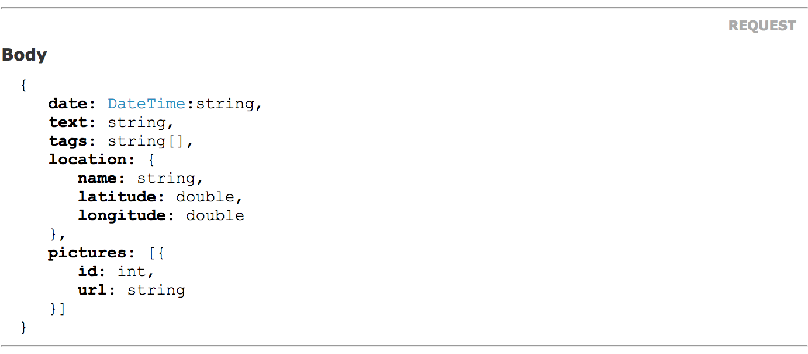
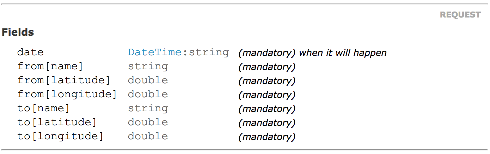
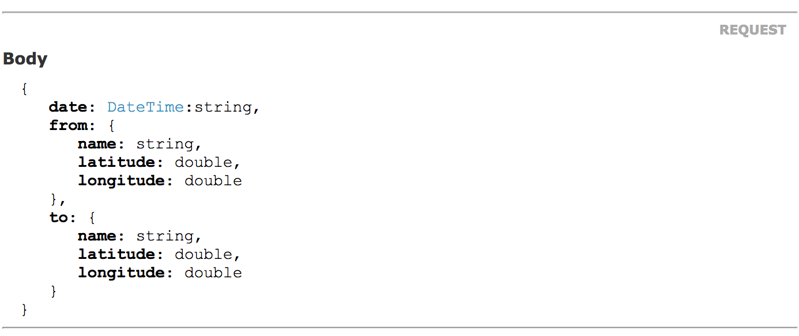

# Plain Objects

Any object can be used as a service parameter, 
but for those service methods used in an API only plain objects can be used.

**What is a plain object?**

In CleaRest, a plain object is a class implementing the interface `CleaRest\Api\Data\PlainObject`
containing only public properties marked with `@var` type
scalar or other plain objects.
A plain object can also be named a DTO (Data Transfer Object).

## Examples

These are some examples of valid plain objects:
```php
<?php
use CleaRest\Api\Data\PlainObject;

class TimelinePost implements PlainObject
{
    /** 
     * @var \DateTime
     */
    public $date;
    /** 
     * @var string
     */
    public $text;
    /**
     * @var string[]
     */
    public $tags;
    /**
     * @var Location
     */
    public $location;
    /**
     * @var Picture[]
     */
    public $pictures;
}

class Location implements PlainObject
{
    /**
     * @var string
     */
    public $name;
    /**
     * @var double
     */
    public $latitude;
    /**
     * @var double
     */
    public $longitude;
}

class Picture implements PlainObject
{
    /**
     * @var int
     */
    public $id;
    /**
     * @var string
     */
    public $url;
}
```
As you can see, only scalars, plain objects or `\DateTime` can be used as property type in plain objects.


## As request field

Parameters annotated with a plain object type will be expected to be found in the request fields.

A service method bound to an endpoint, with this signature...
```php
/**
 * @param TimelinePost $post
 */
public function writePost(TimelinePost $post);
```
... will expect, for example, these fields in the request:
```
post[date]=2017-03-06T16:29:35+0000
post[text]=Finally%20spring%20has%20begun
post[tags][]=spring
post[tags][]=sun
post[location][name]=Berlin%20-%20Kreuzberg
post[location][latitude]=52.4928923
post[location][longitude]=13.4161489
```
If you want to expect a object's value to be in the response body, see the section bellow.

## As request body

To assign the body's content to a parameter, use the annotation `@body` in your service method's annotation:
```
@body $parameterName
```
Look at the example above, now with the `@body` annotation:
```php
/**
 * @body $post
 * @param TimelinePost $post
 */
public fuction writePost(TimelinePost $post);
```
Then a request with *Content-Type* header set to *application/json* could have a body like this:
```json
{
  "date": "2017-03-06T16:29:35+0000",
  "text": "Finally spring has begun",
  "tags": ["spring", "sun"],
  "location": {
    "name": "Berlin - Kreuzberg",
    "latitude": 52.4928923,
    "longitude": 13.4161489
  }
}
```

If you have more than one object as parameter, you can expect one of them in the body, assigning its 
parameter name to the `@body` annotation, and the others will be expected to be in the query string.
Another option is to expect **all the parameters** in the body using the annotation `@body *`.

See the example of method's signature bellow:
```php
/**
 * @body *
 * @param \DateTime $date when it will happen
 * @param Location $from origin
 * @param Location $to destination
 */
public function postTrip(\DateTime $date, Location $from, Location $to);
```
With this annotation, every parameter from the method is expected to be a property in the body's object:
```json
{
  "date": "2017-03-31T18:50:00+1000",
  "from": {
    "name": "Berlin TXL",
    "latitude": 52.5588,
    "longitude": 13.2884
  },
  "to": {
    "name": "Amsterdam AMS",
    "latitude": 52.3105,
    "logintude": 4.7683
  }
}
```

## As response body

Services bound to an API can also only return scalars or plain objects.
Those objects will be converted to array structure and then given to the corresponding `ContentTypeEncoder`
(by default *JSON*), which will encode it to its specific type and return to the client.

## Properties validation

Any property can be validated with annotations `@enum` and `@validate` on the property's doc comment.

Here you can read a bit more about [validations](validations.md).


## Auto generated documentation

All the fields, request and response body are automatically generated in the API's documentation.
See how the documentation looks like for the examples shown above:

 * Method *writePost* with `@body $post` annotation
 
 
 * Method *postTrip* without annotation
 
 
 * Method *postTrip* with `@body *` annotation
 

If you want to know more about the auto generated documentation [click here](auto-docs.md).